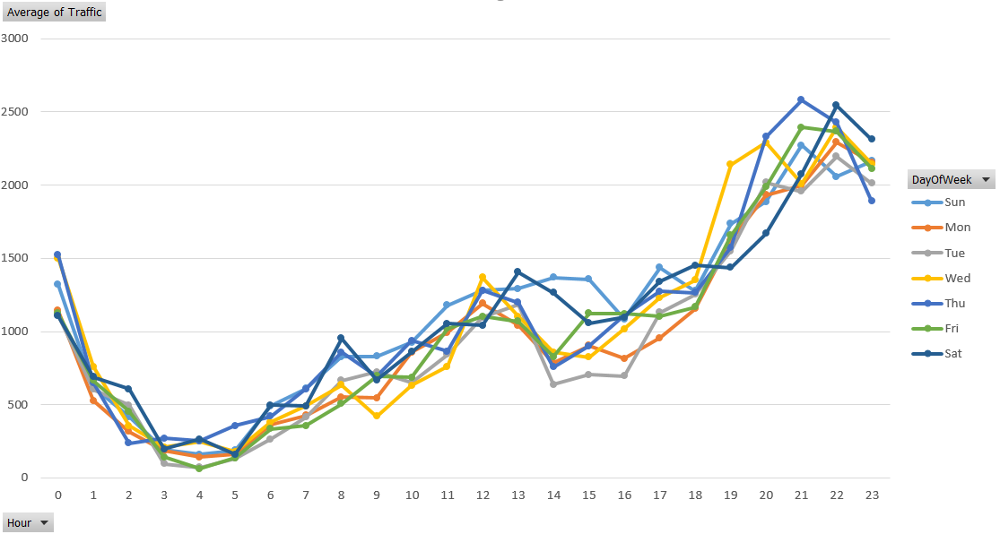

# Traffic Prediction
## Dữ liệu:
**Tính chất của dữ liệu:**
- Dữ liệu là thông tin về traffic của các cell 4G (Cell 4G là thiết bị phát sóng vô tuyến để phục vụ các thiết bị). Traffic của cell 4G được hiểu đơn giản như sau: Khi người dùng sử dụng dịch vụ data trên thiết bị di động, thì thiết bị di động đó sẽ được phục vụ bởi 1 cell 4G được đặt gần đó. Tổng dung lượng data của tất cả các người dùng được phục vụ bởi 1 cell trong vòng 1 giờ được gọi là Traffic của cell đó trong vòng 1 giờ. VD: Cell 039872 đang phục vụ cho 50 thuê bao, mỗi thuê bao trong 1 giờ x sử dụng trung bình 10Mb => Traffic của cell 039872. Vậy traffic của cell này trong giờ x = 50 * 10 = 500Mb.
- Tập dữ liệu có: 57 cell
- Dữ liệu được lấy trong vòng xấp xỉ 1 năm x 24 giờ x 57 cell.
- Tính chất của traffic sẽ có sự khác nhau theo từng giờ (VD: vào khoảng thời gian 10-12h và 19-23h traffic sẽ rất cao, 0-6h traffic sẽ rất thấp); khác nhau giữa các ngày trong tuần (VD: đồ thị traffic của các cell phục vụ tòa nhà công sở, sẽ có traffic cao vào thứ 2-6 và thấp vào thứ 7, chủ nhật); khác nhau vào các sự kiện đặc biệt (lễ hội, tết, ...)

**Dữ liệu được phân bố như sau:**
- TrafficNow: Dữ liệu lưu lượng cần dự đoán
- TrafficBefore(x)Week: Dữ liệu traffic của cùng giờ, ngày cùng thứ của (x) tuần trước
- TrafficBefore1Day: Dữ liệu traffic của cùng giờ ngày hôm qua
- DayOfWeek_xxx: Mô tả ngày trong tuần, được biểu diễn ở dạng one-hot-vector
- HourID_xx: Mô tả giờ trong ngày, được biểu diễn ở dạng one-hot-vector
- Cell_xxxxxx: Tên của cell cần dự đoán, được biểu diễn ở dạng one-hot-vector

## Kết quả:
Sử dụng các thuật toán khác nhau cho ra độ chính xác (MSE) như sau:
- Linear Regression: **385604.21**
- FFNN: **348071.87**
- GradientBoostingRegressor: **366281.39**

So sánh với cách dự đoán bằng phương pháp tính toán bình thường 

$$ TrafficNow = \\frac{TrafficBefore1Week + TrafficBefore2Week + TrafficBefore3Week + TrafficBefore4Week + TrafficBefore5Week + TrafficBefore1Day}{6} $$

Kêt quả: MSE = **370421.69**

=> Khi so sánh kết quả sử dụng ML và cách tính thông thường chỉ tốt hơn ~ **6-7%**"